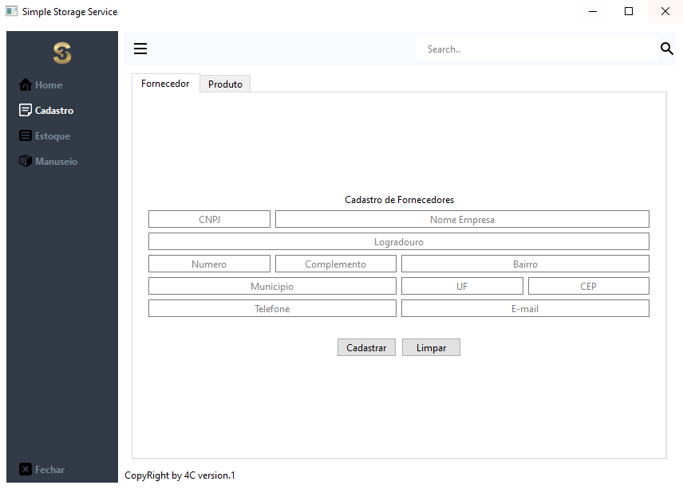

# Simple Storage System

Este projeto tem como objetivo reforçar nosso aprendizados de programação na faculdade impacta, e é a nossa proposta de trabalho de conclusão do curso de Analise e Desenvolvimento de Sistema da faculdade impacta de tecnologia.
<br>

A ideia é criar um sistema simples de gerenciamento de estoque para a plataforma dasktop, e integrar o sistema com um banco de dados em nuvem que armazenará todos os dados.
<br>


<p> 

</p>
<br/>

## Funcionalidades
```
-- Cadastro de Fornecedores
-- Cadastro de Produtos
-- Codigos de barras
-- Codigos de identificação SKU 
-- Controle de entradas
-- Controle de saidas
-- Geração de relatorios
```


<br/><br/>

# 🚀 **Techs**

- Python

  <br/><br/>

# 📚​ **Library**
- PySide6
- import sys
- mysql-connector-python
- pandas
- requests
- json

  <br/><br/>

# 🎨 **Style Guide**

```css
:root {
  /*=========== Colors ===========*/
  color: #fff;
  color: #788596;
  background-color: #f9fafd;
  background-color: #70B9FE;
  background-color: #313a46;
  background-color: rgba(86, 101, 115, 0.5);
  
  
  /*========== Margens / Bottom Menu icon ==========*/

   padding: 5px;
   border: none;
   width: 30px;
   height: 30px;


  /*========== Margens / Bottom Menu Full ==========*/
    border: none;
    border-radius: 3px;
    text-align: left;
    padding: 8px 0 8px 15px; 
    font-weight: bold;
}
```
<br/><br/>

# ✔️ **HOW TO RUN**
Para rodar esse projeto será necessario seguir os passos abaixo:

### Baixe os arquivos
<br>

### Inicie um ambiente virual na sua maquina
  ```
  py -m venv <name of environment>
  ```
  <br>

### Execute o ambiente virtual
  ```
    Windos:
    <name of environment>\Scripts\activate

    MacOS:
    . <name of environment>/bin/activate

    Linux:
    . <name of environment>/bin/activate
    source <name of environment>/Scripts/Activate
  ```
  <br>

### Instale as dependencias necessarias:
  ```Python
    pip install -r requirements.txt
  ```
Agora basta rodar o codigo.
Bom proveito!